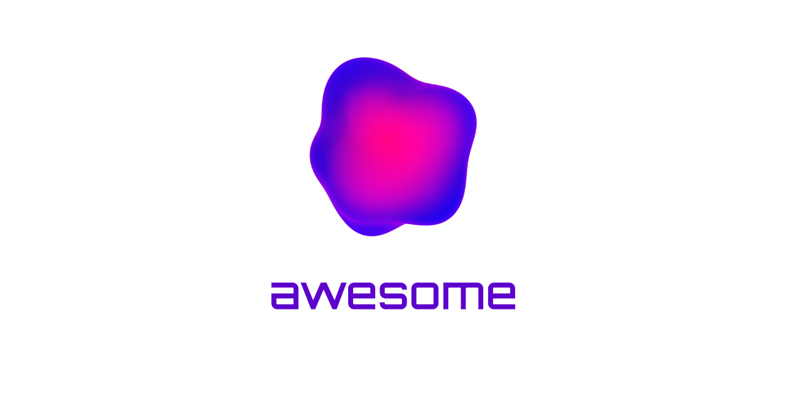

<h1 id="top" align="center">Awesome LLMOps</h1>
<p align="center"><a href="https://awesome.re"></a></p>
<p align="center"></p>

## Table of Contents

- [Table of Contents](#table-of-contents)
- [What is LLMOps?](#what-is-llmops)
- [Prompt Engineering](#prompt-engineering)
- [Models](#models)
- [Optimization](#optimization)
- [Tools (GitHub)](#tools-github)
- [Tools (Other)](#tools-other)
- [RLHF](#rlhf)
- [Awesome](#awesome)
- [Contributing](#contributing)

## What is LLMOps?

LLMOps is a part of MLOps practices, specialized form of MLOps that focuses on managing the entire lifecycle of large language models(LLM).

Starting in 2021, as LLMs evolved rapidly and the technology matured, we began to focus on practices for managing LLMs efficiently, and LLMOps, which are adaptations of traditional MLOps practices to LLMs, began to be talked about.

### LLMOps vs MLOps

| | LLMOps | MLOps |
|-|--------|-------|
| Definition | Tools and infrastructure specifically for the development and deployment of large language models | Tools and infrastructure for general machine learning workflows |
| Focus | Unique requirements and challenges of large language models | General machine learning workflows | Examples of offerings	Foundation model fine-tuning, no-code LLM deployment, GPU access and optimization, prompt experimentation, prompt chaining, data synthesis and augmentation	Model versioning, automated testing, model monitoring, deployment automation, data pipeline management |
| Key technologies | Language model, Transformers library, human-in-the-loop annotation platforms | Kubeflow, MLflow, TensorFlow Extended |
| Key skills | NLP expertise, knowledge of large language models, data management for text data | Data engineering, DevOps, Software engineering, Machine learning expertise |
| Key challenges | Managing and labeling large amounts of text data, fine-tuning foundation models for specific tasks, ensuring fairness and ethics in language models | Managing complex data pipelines, ensuring model interpretability and explainability, addressing model bias and fairness |
| Industry adoption | Emerging, with a growing number of startups and companies focusing on LLMOps | Established, with a large ecosystem of tools and frameworks available
| Future outlook | LLMOps is expected to become an increasingly important area of study as large language models become more prevalent and powerful | MLOps will continue to be a critical component of the machine learning industry, with a focus on improving efficiency, scalability, and model reliability |

[:arrow_up: Go to top](#top)

## Prompt Engineering

- [PromptBase](https://promptbase.com/) - Marketplace of the prompt engineering
- [PromptHero](https://prompthero.com/) - The website for prompt engineering
- [Prompt Search](https://www.ptsearch.info/tags/list/) - The search engine for the prompt engineering
- [Prompt Perfect](https://promptperfect.jina.ai/) - Auto Prompt Optimizer
- [Learn Prompting](https://learnprompting.org/) - The tutorial website for the prompt engineering
- [Blog: Exploring Prompt Injection Attacks](https://research.nccgroup.com/2022/12/05/exploring-prompt-injection-attacks/)
- [Blog: Prompt Leaking](https://learnprompting.org/docs/prompt_hacking/leaking)
- [Paper: Prefix-Tuning: Optimizing Continuous Prompts for Generation](https://aclanthology.org/2021.acl-long.353.pdf)

[:arrow_up: Go to top](#top)

## Models

| Name                       | Parameter size                        | Announcement date |
|----------------------------|---------------------------------------|-------------------|
| BERT-Large (336M)          | 336 million                           | 2018              |
| T5 (11B)                   | 11 billion                            | 2020              |
| Gopher (280B)              | 280 billion                           | 2021              |
| GPT-J (6B)                 | 6 billion                             | 2021              |
| LaMDA (137B)               | 137 billion                           | 2021              |
| Megatron-Turing NLG (530B) | 530 billion                           | 2021              |
| T0 (11B)                   | 11 billion                            | 2021              |
| Macaw (11B)                | 11 billion                            | 2021              |
| GLaM (1.2T)                | 1.2 trillion                          | 2021              |
| T5 FLAN (540B)             | 540 billion                           | 2022              |
| OPT-175B (175B)            | 175 billion                           | 2022              |
| ChatGPT (175B)             | 175 billion                           | 2022              |
| GPT 3.5 (175B)             | 175 billion                           | 2022              |
| AlexaTM (20B)              | 20 billion                            | 2022              |
| Bloom (176B)               | 176 billion                           | 2022              |
| Bard                       | Not yet announced                     | 2023              |
| GPT 4                      | Not yet announced                     | 2023              |
| AlphaCode (41.4B)          | 41.4 billion                          | 2022              |
| Chinchilla (70B)           | 70 billion                            | 2022              |
| Sparrow (70B)              | 70 billion                            | 2022              |
| PaLM (540B)                | 540 billion                           | 2022              |
| NLLB (54.5B)               | 54.5 billion                          | 2022              |
| Alexa TM (20B)             | 20 billion                            | 2022              |
| Galactica (120B)           | 120 billion                           | 2022              |
| UL2 (20B)                  | 20 billion                            | 2022              |
| Jurassic-1 (178B)          | 178 billion                           | 2022              |
| LLaMA (65B)                | 65 billion                            | 2023              |
| Stanford Alpaca (7B)       | 7 billion                             | 2023              |
| GPT-NeoX 2.0 (20B)         | 20 billion                            | 2023              |
| BloombergGPT               | 50 billion                            | 2023              |
| Dolly                      | 6 billion                             | 2023              |
| Jurassic-2                 | Not yet announced                     | 2023              |
| OpenAssistant LLaMa        | 30 billion                            | 2023              |
| Koala                      | 13 billion                            | 2023              |
| Vicuna                     | 13 billion                            | 2023              |
| PaLM2                      | Not yet announced, Smaller than PaLM1 | 2023              |
| LIMA                       | 65 billion                            | 2023              |
| MPT                        | 7 billion                             | 2023              |
| Falcon                     | 40 billion                            | 2023              |
| Llama 2                    | 70 billion                            | 2023              |
| Google Gemini              | Not yet announced                     | 2023              |
| Microsoft Phi-2            | 2.7 billion                           | 2023              |

[:arrow_up: Go to top](#top)

## Optimization

- [Blog: A Gentle Introduction to 8-bit Matrix Multiplication for transformers at scale using Hugging Face Transformers, Accelerate and bitsandbytes](https://huggingface.co/blog/hf-bitsandbytes-integration)
- [Blog: Fine-tuning 20B LLMs with RLHF on a 24GB consumer GPU](https://huggingface.co/blog/trl-peft)
- [Blog: Handling big models for inference](https://huggingface.co/docs/accelerate/usage_guides/big_modeling)
- [Blog: How To Fine-Tune the Alpaca Model For Any Language | ChatGPT Alternative](https://medium.com/@martin-thissen/how-to-fine-tune-the-alpaca-model-for-any-language-chatgpt-alternative-370f63753f94)
- [Paper: LLM.int8(): 8-bit Matrix Multiplication for Transformers at Scale](https://arxiv.org/abs/2208.07339)
- [Gist: Script to decompose/recompose LLAMA LLM models with different number of shards](https://gist.github.com/benob/4850a0210b01672175942203aa36d300)

[:arrow_up: Go to top](#top)

## Tools (GitHub)

- [Stanford Alpaca](https://github.com/tatsu-lab/stanford_alpaca) -  - A repository of Stanford Alpaca project,  a model fine-tuned from the LLaMA 7B model on 52K instruction-following demonstrations.
- [LoRA](https://github.com/microsoft/LoRA) -  - An implementation of "LoRA: Low-Rank Adaptation of Large Language Models".
- [Dolly](https://github.com/databrickslabs/dolly) -  - A large language model trained on the Databricks Machine Learning Platform.
- [DeepSpeed](https://github.com/microsoft/DeepSpeed) -  - A deep learning optimization library that makes distributed training and inference easy, efficient, and effective.
- [LMFlow](https://github.com/OptimalScale/LMFlow) -  - An Extensible Toolkit for Finetuning and Inference of Large Foundation Models. Large Model for All.
- [Promptify](https://github.com/promptslab/Promptify) -  - An utility / tookit for Prompt engineering.
- [Auto-GPT](https://github.com/Significant-Gravitas/Auto-GPT) -  - An experimental open-source attempt to make GPT-4 fully autonomous.
- [Jarvis](https://github.com/microsoft/JARVIS) -  - A system to connect LLMs with ML community, a composite model connector via the LLM interface.
- [dalai](https://github.com/cocktailpeanut/dalai) -  - The cli tool to run LLaMA on the local machine.
- [haystack](https://github.com/deepset-ai/haystack) -  -an open source NLP framework to interact with the data using Transformer models and LLMs.
- [langchain](https://github.com/hwchase17/langchain) -  - The library which assists in the development of applications with LLM.
- [langflow](https://github.com/logspace-ai/langflow) -  - An UI for LangChain, designed with react-flow to provide an effortless way to experiment and prototype flows.
- [deeplake](https://github.com/activeloopai/deeplake) -  - Data Lake for Deep Learning. Build, manage, query, version, & visualize datasets.
- [alpaca-lora](https://github.com/tloen/alpaca-lora) -  - Instruct-tune LLaMA on consumer hardware.
- [bosquet](https://github.com/BrewLLM/bosquet) -  - LLMOps for Large Language Model based applications.
- [llama_index](https://github.com/jerryjliu/llama_index) -  - A project that provides a central interface to connect your LLM's with external data.
- [gradio](https://github.com/gradio-app/gradio) -  - An UI helper for the machine learning model.
- [sharegpt](https://github.com/domeccleston/sharegpt) -  - An open-source Chrome Extension for you to share your wildest ChatGPT conversations with one click.
- [Starwhale](https://github.com/star-whale/starwhale) -  - An MLOps/LLMOps platform for model building, evaluation, and fine-tuning.
- [keras-nlp](https://github.com/keras-team/keras-nlp) -  - A natural language processing library that supports users through their entire development cycle.
- [Snowkel AI](https://github.com/snorkel-team/snorkel) -  - The data platform for foundation models.

[:arrow_up: Go to top](#top)

## Tools (Other)

- [PaLM2 API](https://developers.generativeai.google/) - An API service that makes PaLM2, Large Language Models (LLMs), available to Google Cloud Vertex AI.
- [Perspective API](https://perspectiveapi.com/) - A tool that can help mitigate toxicity and ensure healthy dialogue online.

[:arrow_up: Go to top](#top)

## RLHF

- [evals](https://github.com/openai/evals) -  - A curated list of reinforcement learning with human feedback resources.
- [trlx](https://github.com/CarperAI/trlx) -  - A repo for distributed training of language models with Reinforcement Learning via Human Feedback. (RLHF)
- [PaLM-rlhf-pytorch](https://github.com/lucidrains/PaLM-rlhf-pytorch) -  - Implementation of RLHF (Reinforcement Learning with Human Feedback) on top of the PaLM architecture.

[:arrow_up: Go to top](#top)

## Awesome

- [Hannibal046/Awesome-LLM](https://github.com/Hannibal046/Awesome-LLM)
- [KennethanCeyer/awesome-llm](https://github.com/KennethanCeyer/awesome-llm)
- [f/awesome-chatgpt-prompts](https://github.com/f/awesome-chatgpt-prompts)
- [promptslab/Awesome-Prompt-Engineering](https://github.com/promptslab/Awesome-Prompt-Engineering)
- [tensorchord/awesome-open-source-llmops](https://github.com/tensorchord/awesome-open-source-llmops)
- [opendilab/awesome-RLHF](https://github.com/opendilab/awesome-RLHF)

[:arrow_up: Go to top](#top)

## Contributing

We welcome contributions to the Awesome LLMOps list! If you'd like to suggest an addition or make a correction, please follow these guidelines:

1. Fork the repository and create a new branch for your contribution.
2. Make your changes to the README.md file.
3. Ensure that your contribution is relevant to the topic of LLMOps.
4. Use the following format to add your contribution:
  ```markdown
  [Name of Resource](Link to Resource) - Description of resource
  ```
5. Add your contribution in alphabetical order within its category.
6. Make sure that your contribution is not already listed.
7. Provide a brief description of the resource and explain why it is relevant to LLMOps.
8. Create a pull request with a clear title and description of your changes.

We appreciate your contributions and thank you for helping to make the Awesome LLMOps list even more awesome!

[:arrow_up: Go to top](#top)
